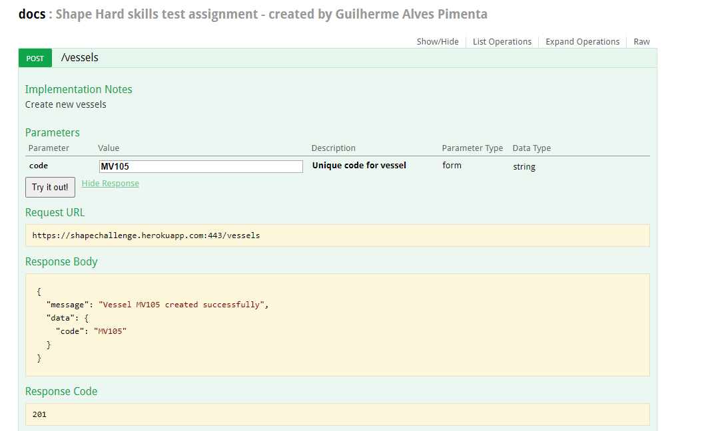

# This repository is dedicated to solving the challenge proposed by the shape digital company

The challenge is presented below:

The challenge was to create a simple python api, but I took the liberty of creating a frontend to consume the available endpoints.

The front is presented below:

The front is hosted on netlify, and you can easily acess it on : https://shapechallenge.netlify.app/

The api is hosted on heroku and has the following endpoints:

The base url is https://shapechallenge.herokuapp.com/ 

The api documentation is presented on: https://shapechallenge.herokuapp.com/docs.html

It`s possible to test the available endpoints as shown below:

