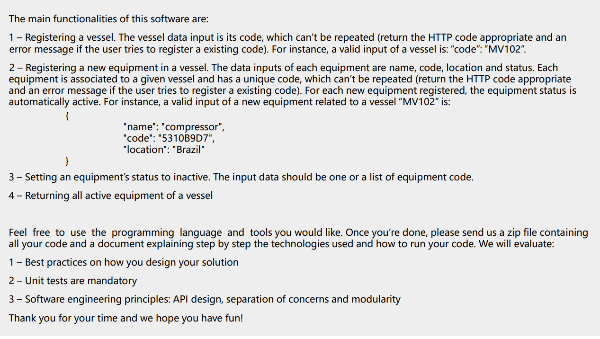
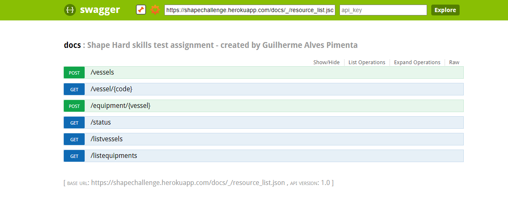
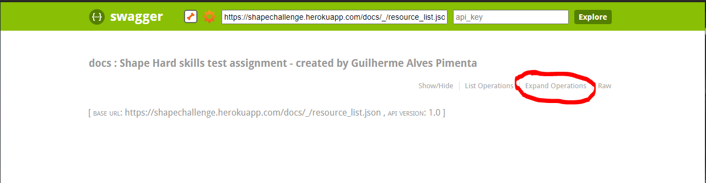
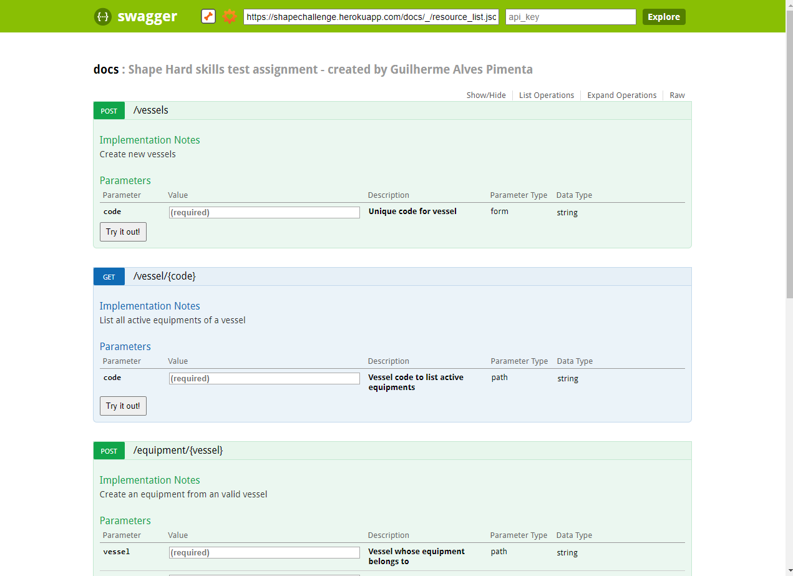

# This repository is dedicated to solving the challenge proposed by the shape digital company

The challenge is presented below:



<br/>

The challenge was to create a Python API, but I also created a front-end in React to consume the available endpoints.

**The front functionalities is presented below:**


 
The frontend is hosted on Netlify, click the link to see more: https://shapechallenge.netlify.app/

<br/>

The API is written in Python/Flask and hosted on Heroku.

**BASE URL:** `https://shapechallenge.herokuapp.com/`

The API has the following endpoints:



<br/>

Test the available endpoints in: https://shapechallenge.herokuapp.com/docs.html



<br/>



<br/>


<br/>
<br/>


### Setup locally
```bash
$ git clone https://github.com/GuiPimenta-Dev/desafio_shape.git
$ cd desafio_shape
```
### Configure environment variables
```bash
$ cp env_example.py env.py
```

Edit env.py and place your own Mongo DB credentials and collections

### Start the server
```bash
$ docker-compose build
$ docker-compose up
```
The server will start running at http://localhost:5000/

<br/>
<br/>

### Test Output
```bash
$ pytest .
Test session starts (platform: win32, Python 3.9.4, pytest 6.2.4, pytest-sugar 0.9.4)
rootdir: C:\Users\guial\PycharmProjects\home_automation\tests
plugins: sugar-0.9.4
collecting ... 
 test_equipament.py ✓                                                                                   5% ▌
 test_equipament.py ✓✓                                                                                 11% █▏        
 test_equipament.py ✓✓✓                                                                                16% █▋        
 test_equipament.py ✓✓✓✓                                                                               21% ██▏       
 test_equipament.py ✓✓✓✓✓                                                                              26% ██▋       
 test_equipament.py ✓✓✓✓✓✓                                                                             32% ███▎      
 test_equipament.py ✓✓✓✓✓✓✓                                                                            37% ███▊      
 test_equipament.py ✓✓✓✓✓✓✓✓                                                                           42% ████▎     

 test_status.py ✓                                                                                      47% ████▊     
 test_status.py ✓✓                                                                                     53% █████▍    
 test_status.py ✓✓✓                                                                                    58% █████▊    

 test_vessel.py ✓                                                                                      63% ██████▍   
 test_vessel.py ✓✓                                                                                     68% ██████▉   
 test_vessel.py ✓✓✓                                                                                    74% ███████▍  
 test_vessel.py ✓✓✓✓                                                                                   79% ███████▉  

 test_vessels.py ✓                                                                                     84% ████████▌ 
 test_vessels.py ✓✓                                                                                    89% ████████▉ 
 test_vessels.py ✓✓✓                                                                                   95% █████████▌ 
 test_vessels.py ✓✓✓✓                                                                                  100% ██████████                                                                                                                                    

Results (4.48s):
      19 passed
```
<br/>
<br/>


### Technologies used:

**1. Docker**

* Docker is crucial to maintain application reliability by ensuring a standard version for all dependencies and environments.

* Used on local deploys.

 <br/>

**2. Flask**

* I chose to use Flask instead of Django due to the speed of development that the micro-framework would provide me when building the APIs.

* Used to build the endpoints.
 
<br/>
 

**3. Heroku**

* Great free cloud option for hosting back-end applications with CI/CD integrations.
     
* Used to host the API.

<br/>

      
**4. MongoDB**

 * MongoDB was a great choice for its performance and speed of development since complex relationships between tables were not needed.

 * Used to store data.

<br/>

**5. Netlify**
    
* Great free cloud option for hosting front-end applications with CI/CD integrations.

* Used to host the front-end.

 <br/>
 
**6. Python**

* My favorite language nowadays and it is mandatory for the challenge.

* Used to build the endpoints.
      
<br/>

**7. React**

* I chose React because it is the Javascript framework that I have the most control over.
      
* Used to build the front-end.

<br/>

**8. Swagger**

 * Great tool to facilitate the visualization of endpoints between different teams.

 * Used to build the API documentation.
      
<br/>
Thanks for reading!
