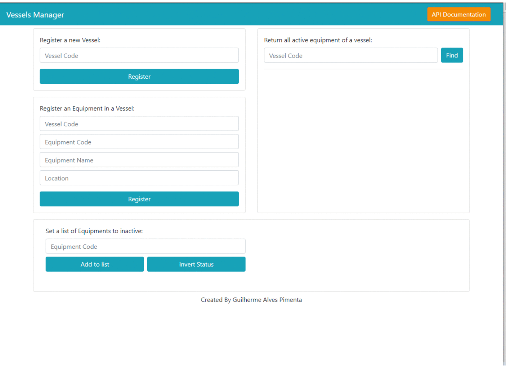

# This repository is dedicated to solving the challenge proposed by the shape digital company

The challenge is presented below:


The challenge was to create a simple python api, but I took the liberty of creating a frontend to consume the available endpoints.

**The front functionalities is presented below:**



 
The front is hosted on Netlify:   https://shapechallenge.netlify.app/


**The api has the following endpoints:**


The api is hosted on Heroku: https://shapechallenge.herokuapp.com/


**It`s possible to test the available endpoints in https://shapechallenge.herokuapp.com/docs.html**


### Setup locally
```bash
$ git clone https://github.com/GuiPimenta-Dev/desafio_shape.git
$ cd desafio_shape
```

### Configure environment variables
```bash
$ cp env_example.py env.py
```

Edit env.py and place your own Mongo DB credentials and collections

### Start the server
```bash
$ docker-compose build
$ docker-compose up
```

The server will start running at http://localhost:5000/


### Test Output
```bash
$ pytest .
Test session starts (platform: win32, Python 3.9.4, pytest 6.2.4, pytest-sugar 0.9.4)
rootdir: C:\Users\guial\PycharmProjects\home_automation\tests
plugins: sugar-0.9.4
collecting ... 
 test_equipament.py ✓                                                                                   5% ▌
 test_equipament.py ✓✓                                                                                 11% █▏        
 test_equipament.py ✓✓✓                                                                                16% █▋        
 test_equipament.py ✓✓✓✓                                                                               21% ██▏       
 test_equipament.py ✓✓✓✓✓                                                                              26% ██▋       
 test_equipament.py ✓✓✓✓✓✓                                                                             32% ███▎      
 test_equipament.py ✓✓✓✓✓✓✓                                                                            37% ███▊      
 test_equipament.py ✓✓✓✓✓✓✓✓                                                                           42% ████▎     

 test_status.py ✓                                                                                      47% ████▊     
 test_status.py ✓✓                                                                                     53% █████▍    
 test_status.py ✓✓✓                                                                                    58% █████▊    

 test_vessel.py ✓                                                                                      63% ██████▍   
 test_vessel.py ✓✓                                                                                     68% ██████▉   
 test_vessel.py ✓✓✓                                                                                    74% ███████▍  
 test_vessel.py ✓✓✓✓                                                                                   79% ███████▉  

 test_vessels.py ✓                                                                                     84% ████████▌ 
 test_vessels.py ✓✓                                                                                    89% ████████▉ 
 test_vessels.py ✓✓✓                                                                                   95% █████████▌ 
 test_vessels.py ✓✓✓✓                                                                                  100% ██████████                                                                                                                                    

Results (4.48s):
      19 passed
```

### Technologies used:

* Docker
* Flask
* MongoDB
* React
* Swagger

